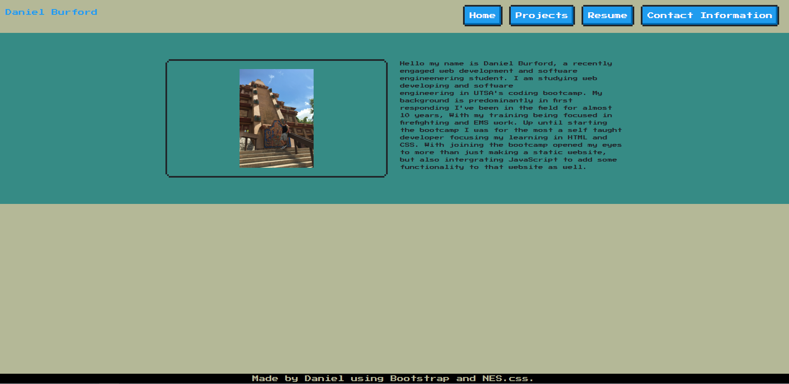
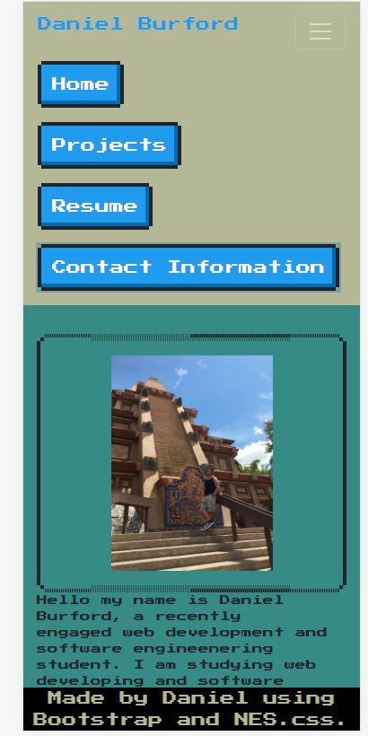
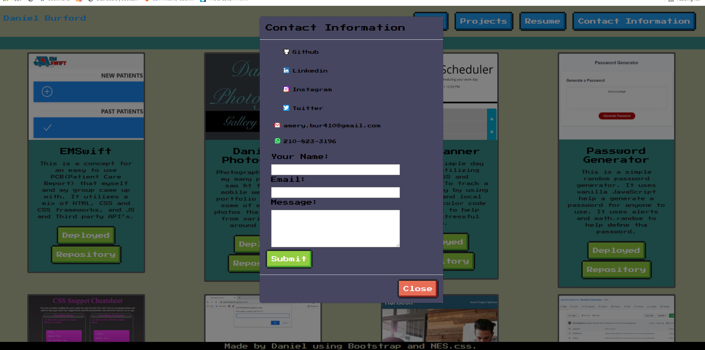
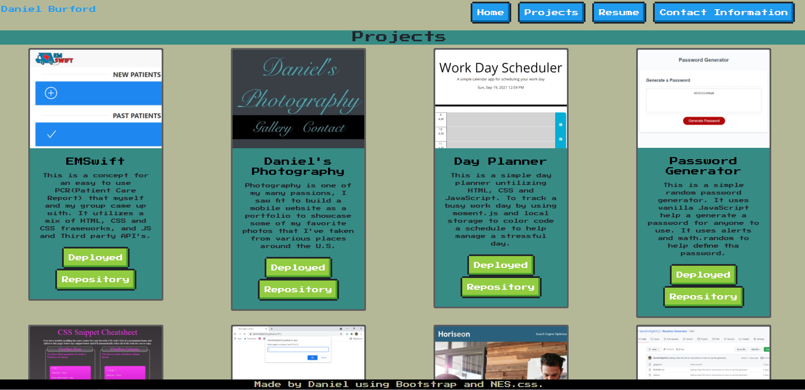

# Porfolio Refactoring
[Deployed](https://dannfirefight322.github.io/my2ndPortfolio/)
### With the help of nes.css i was able to achieve an 8-bit style for my portfolio.
### https://nostalgic-css.github.io/NES.css/

  ## Table Of  Contents
  1.[Description](#desc) 
  2.[Install Information](#install) 
  3.[Usage Information](#use) 
  4.[Contributions](#cont) 
  5.[Testing Information](#test) 
  6.[License Information](#lic) 
  7.[Questions](#ques)  
  # 
  # Description
  ### This is another reiteration of my personal portfolio updating the style and adding a little more functionality. It is mobile responsive as well.
  # 
  # Install Information
  ### None
  # 
  # Usage Information
  ### My personal use.
  # 
  # Contribution
  ### Daniel Burford
  # 
  # Testing Information
  ### 
  # 
  # License
  ### 
  # 
  # Questions
  ### Github: https://github.com/dannfirefight322 
  ### Email: amery.bur410@gmail.com
  
  